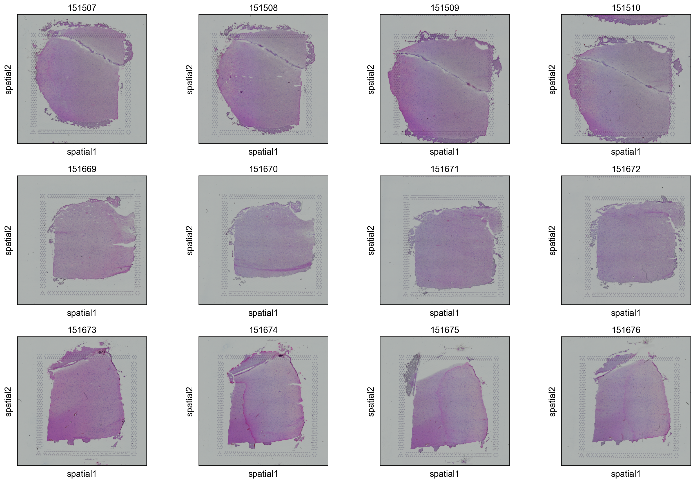
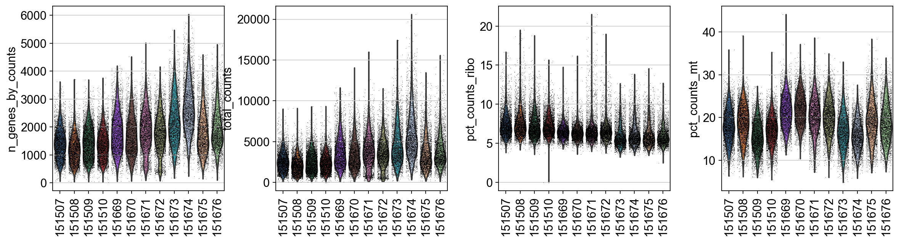
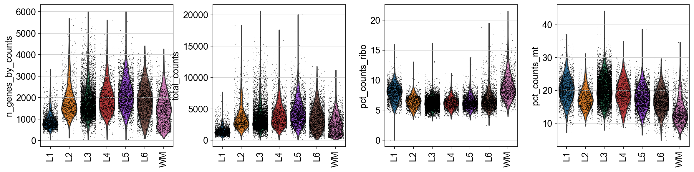
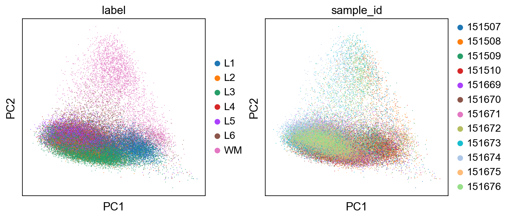
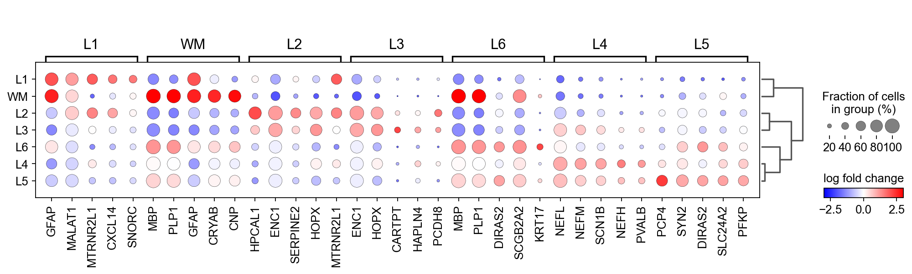
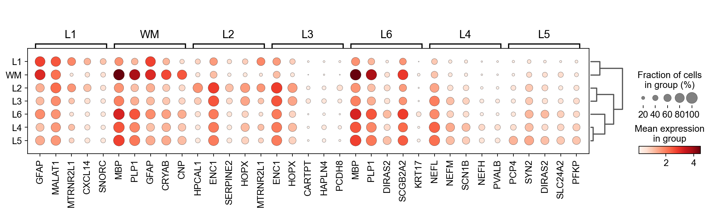
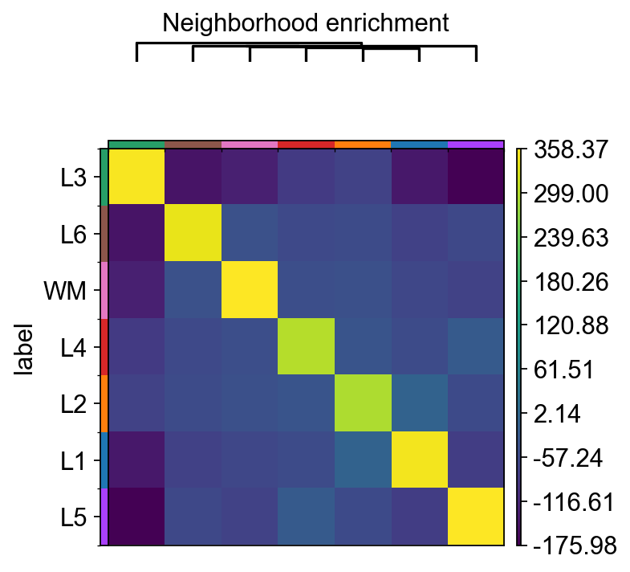

```python
import warnings
import scanpy as sc
import squidpy as sq
import anndata as an
import pandas as pd
import numpy as np
import matplotlib as mpl
import matplotlib.pyplot as plt
import seaborn as sns
from urllib import request
import scanorama
import json
import os

sc.settings.set_figure_params(dpi=80)
#sc.set_figure_params(facecolor="white", figsize=(8, 8))
warnings.simplefilter(action='ignore', category=FutureWarning)
sc.settings.verbosity = 3
```

# Глобальное окружение

## Подгрузим данные


```python
os.listdir('../../data/anndata_objects/spatial_libd_human')
```


    ['151507.h5ad',
     '151508.h5ad',
     '151509.h5ad',
     '151510.h5ad',
     '151669.h5ad',
     '151670.h5ad',
     '151671.h5ad',
     '151672.h5ad',
     '151673.h5ad',
     '151674.h5ad',
     '151675.h5ad',
     '151676.h5ad',
     'spatial_libd_human.h5ad']


```python
adata = sc.read_h5ad('../../data/anndata_objects/spatial_libd_human/spatial_libd_human.h5ad')
adata.obs_names_make_unique()
adata
```

    C:\Users\aleks\anaconda3\envs\scanorama39\lib\site-packages\anndata\_core\anndata.py:1828: UserWarning: Observation names are not unique. To make them unique, call `.obs_names_make_unique`.
      utils.warn_names_duplicates("obs")
    


    AnnData object with n_obs × n_vars = 47681 × 33538
        obs: 'in_tissue', 'array_row', 'array_col', 'label', 'sample_id'
        var: 'gene_ids', 'feature_types', 'genome'
        uns: 'spatial'
        obsm: 'spatial'


Оставим споты только с разметкой


```python
adata = adata[adata.obs.label.notna()]
```


```python
adata.obs.label.value_counts()
```


    L3    17587
    L5     7300
    L6     6201
    L1     5322
    WM     4514
    L4     3547
    L2     2858
    Name: label, dtype: int64


```python
samples = list(adata.uns['spatial'].keys())
```

## Посмотрим на изображения


```python
sq.pl.spatial_scatter(adata, library_key='sample_id', title=samples, ncols=4)
```


    

    


```python
sq.pl.spatial_scatter(adata, color=['label'], library_key='sample_id', ncols=4, title=samples, size=1.1)
```

    C:\Users\aleks\anaconda3\envs\scanorama39\lib\site-packages\anndata\compat\_overloaded_dict.py:106: ImplicitModificationWarning: Trying to modify attribute `._uns` of view, initializing view as actual.
      self.data[key] = value
    


    

    


## Посмотрим на метрики


```python
# add info on mitochondrial and hemoglobin genes to the objects.
adata.var['mt'] = adata.var_names.str.startswith('MT-')
adata.var['hb'] = adata.var_names.str.contains(("^HB[AB]"))
adata.var['ribo'] = adata.var_names.str.contains(("^RP[LS]"))

sc.pp.calculate_qc_metrics(
    adata, qc_vars=['mt','hb','ribo'],
    percent_top=None, log1p=False, inplace=True)
```


```python
sc.pl.violin(adata,
             keys = ['n_genes_by_counts', 'total_counts','pct_counts_ribo', 'pct_counts_mt'],
             jitter=0.4, groupby = 'sample_id', rotation= 90, size=0.5)
```


    

    


```python
sc.pl.violin(adata,
             keys = ['n_genes_by_counts', 'total_counts','pct_counts_ribo', 'pct_counts_mt'],
             jitter=0.4, groupby = 'label', rotation= 90, size=0.5)
```


    

    


```python
sq.pl.spatial_scatter(adata,
                      color=['n_genes_by_counts', 'total_counts','pct_counts_ribo', 'pct_counts_mt', 'label'],
                      library_key='sample_id', ncols=5, img=False, size=1.3)
```


    

    


## PCA


```python
sc.pp.normalize_total(adata, target_sum=1e4)
sc.pp.log1p(adata)
sc.tl.pca(adata)
```

    normalizing counts per cell
        finished (0:00:00)
    computing PCA
        with n_comps=50
        finished (0:02:55)
    


```python
sc.pl.pca(adata, 
          color=['label', 'sample_id'],
          ncols=2, show=True)
```

    C:\Users\aleks\anaconda3\envs\scanorama39\lib\site-packages\scanpy\plotting\_tools\scatterplots.py:392: UserWarning: No data for colormapping provided via 'c'. Parameters 'cmap' will be ignored
      cax = scatter(
    C:\Users\aleks\anaconda3\envs\scanorama39\lib\site-packages\scanpy\plotting\_tools\scatterplots.py:392: UserWarning: No data for colormapping provided via 'c'. Parameters 'cmap' will be ignored
      cax = scatter(



    


## Дифф. экспр


```python
remove = adata.var_names.str.startswith('MT-')
keep = np.invert(remove)
print(sum(remove))

adata = adata[:,keep]
```

    13
    


```python
sc.tl.rank_genes_groups(adata, groupby='label', method='wilcoxon')
```

    ranking genes
    

    C:\Users\aleks\anaconda3\envs\scanorama39\lib\site-packages\anndata\compat\_overloaded_dict.py:106: ImplicitModificationWarning: Trying to modify attribute `._uns` of view, initializing view as actual.
      self.data[key] = value
    

        finished: added to `.uns['rank_genes_groups']`
        'names', sorted np.recarray to be indexed by group ids
        'scores', sorted np.recarray to be indexed by group ids
        'logfoldchanges', sorted np.recarray to be indexed by group ids
        'pvals', sorted np.recarray to be indexed by group ids
        'pvals_adj', sorted np.recarray to be indexed by group ids (0:08:39)
    


```python
sc.pl.rank_genes_groups_dotplot(adata, n_genes=5, groupby="label", values_to_plot='logfoldchanges',
                                min_logfoldchange=1, vmax=3, vmin=-3, cmap='bwr')
```

    WARNING: dendrogram data not found (using key=dendrogram_label). Running `sc.tl.dendrogram` with default parameters. For fine tuning it is recommended to run `sc.tl.dendrogram` independently.
        using 'X_pca' with n_pcs = 50
    Storing dendrogram info using `.uns['dendrogram_label']`
    

    C:\Users\aleks\anaconda3\envs\scanorama39\lib\site-packages\scanpy\plotting\_dotplot.py:749: UserWarning: No data for colormapping provided via 'c'. Parameters 'cmap', 'norm' will be ignored
      dot_ax.scatter(x, y, **kwds)
    


    

    


```python
sc.pl.rank_genes_groups_dotplot(adata, n_genes=5, groupby="label", min_logfoldchange=1)
```

    C:\Users\aleks\anaconda3\envs\scanorama39\lib\site-packages\scanpy\plotting\_dotplot.py:749: UserWarning: No data for colormapping provided via 'c'. Parameters 'cmap', 'norm' will be ignored
      dot_ax.scatter(x, y, **kwds)
    


    

    


## Spatial features


```python
sq.gr.spatial_neighbors(
    adata, coord_type="generic", library_key="sample_id", delaunay=True
)
```

    Creating graph using `generic` coordinates and `None` transform and `12` libraries.
    Adding `adata.obsp['spatial_connectivities']`
           `adata.obsp['spatial_distances']`
           `adata.uns['spatial_neighbors']`
    Finish (0:00:12)
    


```python
sq.gr.nhood_enrichment(adata, cluster_key="label")
sq.pl.nhood_enrichment(adata, cluster_key="label", method="average")
```

    Calculating neighborhood enrichment using `1` core(s)
    


      0%|          | 0/1000 [00:00<?, ?/s]


    Adding `adata.uns['label_nhood_enrichment']`
    Finish (0:00:17)



    


```python
sq.gr.spatial_autocorr(adata, mode="moran", genes=adata.var_names)
```

    C:\Users\aleks\anaconda3\envs\scanorama39\lib\site-packages\scanpy\metrics\_gearys_c.py:293: UserWarning: 7943 variables were constant, will return nan for these.
      warnings.warn(
    

    Calculating moran's statistic for `None` permutations using `1` core(s)
    Adding `adata.uns['moranI']`
    Finish (0:00:00)
    


```python
adata.uns["moranI"].head(15)
```


<div>
<style scoped>
    .dataframe tbody tr th:only-of-type {
        vertical-align: middle;
    }

    .dataframe tbody tr th {
        vertical-align: top;
    }

    .dataframe thead th {
        text-align: right;
    }
</style>
<table border="1" class="dataframe">
  <thead>
    <tr style="text-align: right;">
      <th></th>
      <th>I</th>
      <th>pval_norm</th>
      <th>var_norm</th>
      <th>pval_norm_fdr_bh</th>
    </tr>
  </thead>
  <tbody>
    <tr>
      <th>MTRNR2L1</th>
      <td>0.755253</td>
      <td>0.0</td>
      <td>0.000007</td>
      <td>NaN</td>
    </tr>
    <tr>
      <th>SCGB2A2</th>
      <td>0.727467</td>
      <td>0.0</td>
      <td>0.000007</td>
      <td>NaN</td>
    </tr>
    <tr>
      <th>MBP</th>
      <td>0.587196</td>
      <td>0.0</td>
      <td>0.000007</td>
      <td>NaN</td>
    </tr>
    <tr>
      <th>MTRNR2L8</th>
      <td>0.584666</td>
      <td>0.0</td>
      <td>0.000007</td>
      <td>NaN</td>
    </tr>
    <tr>
      <th>SCGB1D2</th>
      <td>0.543697</td>
      <td>0.0</td>
      <td>0.000007</td>
      <td>NaN</td>
    </tr>
    <tr>
      <th>PLP1</th>
      <td>0.487420</td>
      <td>0.0</td>
      <td>0.000007</td>
      <td>NaN</td>
    </tr>
    <tr>
      <th>GFAP</th>
      <td>0.454786</td>
      <td>0.0</td>
      <td>0.000007</td>
      <td>NaN</td>
    </tr>
    <tr>
      <th>SAA1</th>
      <td>0.433963</td>
      <td>0.0</td>
      <td>0.000007</td>
      <td>NaN</td>
    </tr>
    <tr>
      <th>MOBP</th>
      <td>0.420469</td>
      <td>0.0</td>
      <td>0.000007</td>
      <td>NaN</td>
    </tr>
    <tr>
      <th>MT3</th>
      <td>0.386994</td>
      <td>0.0</td>
      <td>0.000007</td>
      <td>NaN</td>
    </tr>
    <tr>
      <th>MGP</th>
      <td>0.384634</td>
      <td>0.0</td>
      <td>0.000007</td>
      <td>NaN</td>
    </tr>
    <tr>
      <th>TF</th>
      <td>0.368996</td>
      <td>0.0</td>
      <td>0.000007</td>
      <td>NaN</td>
    </tr>
    <tr>
      <th>IGKC</th>
      <td>0.368921</td>
      <td>0.0</td>
      <td>0.000007</td>
      <td>NaN</td>
    </tr>
    <tr>
      <th>FABP4</th>
      <td>0.355594</td>
      <td>0.0</td>
      <td>0.000007</td>
      <td>NaN</td>
    </tr>
    <tr>
      <th>NRGN</th>
      <td>0.335550</td>
      <td>0.0</td>
      <td>0.000007</td>
      <td>NaN</td>
    </tr>
  </tbody>
</table>
</div>


```python
sq.pl.spatial_scatter(adata,
                      color=['PLP1', 'GFAP', 'ENC1', 'label'],
                      library_key='sample_id', ncols=4, img=True, size=1.3)
```

    C:\Users\aleks\anaconda3\envs\scanorama39\lib\site-packages\anndata\compat\_overloaded_dict.py:106: ImplicitModificationWarning: Trying to modify attribute `._uns` of view, initializing view as actual.
      self.data[key] = value
    


    

    

