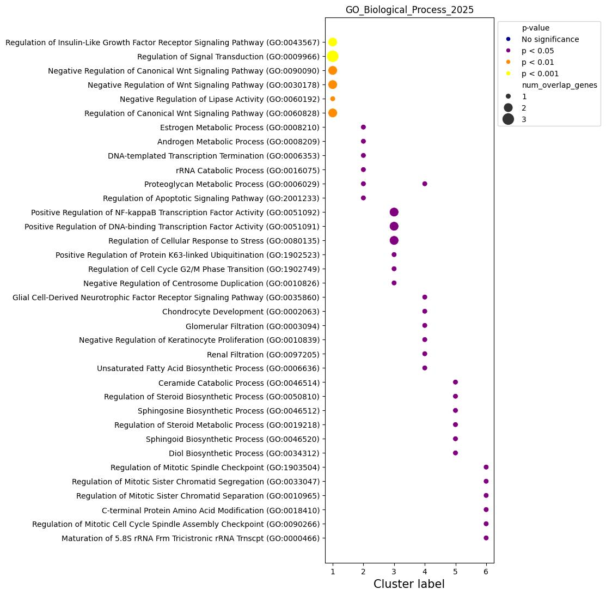
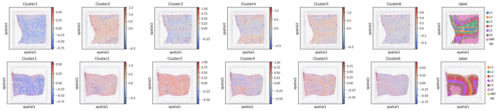
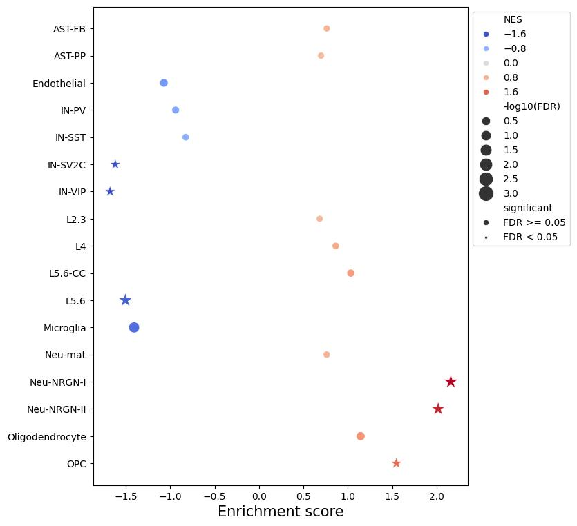
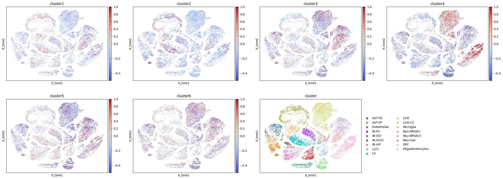

# Human-Specific Features of Prefrontal Cortex Spatial Organization  
Master’s thesis project by Aljes Binkevich

---

## Description

The spatial organization of mammalian brain sections is closely tied to their function. Laminar cortical layers display unique gene expression, morphology, and connectivity patterns. This thesis examines the prefrontal cortex (PFC) of newborn human, chimpanzee, and macaque using Visium spatial transcriptomics to uncover evolutionary differences. Key aims:

- Segment PFC layers in 10x Genomics Visium data  
- Identify human-specific gene expression profiles  
- Perform functional enrichment of human-specific genes  
- Map these genes to PFC cell types  
- Analyze transcription factor networks linked to human-specific genes  

---

## Table of Contents

- [Human-Specific Features of Prefrontal Cortex Spatial Organization](#human-specific-features-of-prefrontal-cortex-spatial-organization)
  - [Description](#description)
  - [Table of Contents](#table-of-contents)
  - [Directory Structure](#directory-structure)
  - [Installation \& Docker](#installation--docker)
  - [Analysis Steps \& Figure Previews](#analysis-steps--figure-previews)
    - [1. Validation of Layer Segmentation](#1-validation-of-layer-segmentation)
    - [2. Human-Specific Gene Identification](#2-human-specific-gene-identification)
    - [3. Cell-Type Enrichment Analysis](#3-cell-type-enrichment-analysis)
    - [4. Transcription Factor Activity Analysis](#4-transcription-factor-activity-analysis)

---

## Directory Structure

```text
├── data/                 # raw and processed data
├── docker/               # Dockerfile and environment specifications 
├── enrichment_analysis/  # cell-type enrichment analysis
├── preprocess/           # data processing notebooks
├── QC/                   # quality control notebooks
├── tf_activity/          # transcription factor activity analysis
├── utils/                # python package with helper functions
└── validate_layers/      # layer segmentation validation  
```

---

## Installation & Docker

A pre-built Docker image is available at:

```bash
quay.io/claptar/spatialmpfc:thesis
```

To pull and run:

```bash
docker pull quay.io/claptar/spatialmpfc:thesis
docker run --rm -it \
  -p 8888:8888 \
  -v "${PWD}:/workspace" \
  --name spatialmpfc \
  quay.io/claptar/spatialmpfc:thesis
```

- Launches JupyterLab at http://localhost:8888/  
- Mounts your current directory at `/workspace` inside the container  


---

## Analysis Steps & Figure Previews
### 1. Validation of Layer Segmentation
_For more details check the [`validate_layers/`](validate_layers/README.md) directory._

To validate layer segmentation, we compared expression profiles of each specie layer markers with expression profiles of layer markers from external dataset. For this purpose [spatialLIBD](https://github.com/LieberInstitute/spatialLIBD) dataset was selected.

<p align="center">
  
</p>

### 2. Human-Specific Gene Identification

_For more details check the [`human_specific_genes/`](human_specific/README.md) directory._

To identify human-specific genes, we performed differential expression analysis between human, chimpanzee, and macaque pseudobulk samples using ANCOVA. Human-specific genes were defined as those with significant differential expression in the human samples compared to the other species and validated against newborn human samples
<p align="center">
  
</p>


Pseudobulk expression profiles of human-specific genes were clustered using hierarchical clustering to identify distinct expression patterns across species. The resulting clusters were visualized as a heatmap and correlation matrix.


To visualize the average layer expression for each cluster across species, smoothed spline profiles were generated. These profiles highlight the unique expression patterns of human-specific genes.
<p align="center">
  
</p>

Functional enrichment analysis was performed on the human-specific gene clusters to identify biological processes and pathways enriched in these genes

<p align="center">
  
  
</p>


To visualize expression patterns of human-specific gene clusters on Visium sections, Wiener-filtered profiles were generated. This provides a spatial context for the expression of these genes across the PFC layers.


### 3. Cell-Type Enrichment Analysis

_For more details check the [`enrichment_analysis/`](enrichment_analysis/README.md) directory._

Cell-type enrichment analysis was performed to identify the distribution of major cell types across pseudobulk samples. For this puprpose the following dataset was used:
- **Lab:** Kriegstein
- **Publication:** Velmeshev et al. Science. 2019.
- **PubMed Abstract:** 31097668
- **NCBI Bioproject:** PRJNA434002
- **Submitted by:** Dmitry Velmeshev (2019-10-18), Version 3
- **Direct link to this plot for manuscripts:** [https://autism.cells.ucsc.edu](https://autism.cells.ucsc.edu)


For each cell type, enrichment scores were computed and visualized in a dotplot format. This provides an overview of how human-specific genes are enriched across different cell types in the PFC
<p align="center">
  
</p>


To show cluster-specific enrichment patterns, a t-SNE projection was used with normalized average expression of human-specific genes overlaid. This visualization highlights how different clusters of human-specific genes are enriched in specific cell types.


### 4. Transcription Factor Activity Analysis
_For more details check the [`tf_activity/`](tf_activity/README.md) directory._

Transcription factor (TF) activity analysis was performed to infer TF activity scores from pseudobulk expression data. This analysis helps identify TFs that are differentially active in human samples compared to other primates.

The analysis involved calculating TF activity scores, performing ANCOVA to test for differences across conditions, and identifying human-specific TFs based on statistical tests and visualization.

Only one human-specific TF was identified, which is shown in the figure below. The smoothed spline profiles of this TF and its human-specific gene target highlight the unique activity patterns in the human PFC.
<p align="center">
  
</p>
