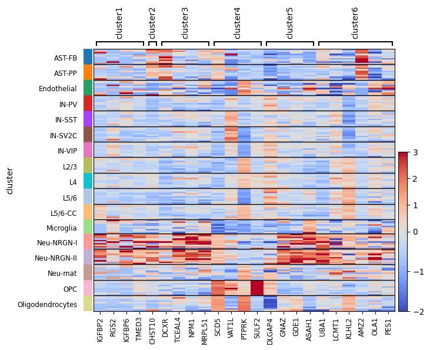

# Enrichment Analysis

This folder contains notebooks and results for performing cell-type enrichment using the following dataset

- **Lab:** Kriegstein
- **Publication:** Velmeshev et al. Science. 2019.
- **PubMed Abstract:** 31097668
- **NCBI Bioproject:** PRJNA434002
- **Submitted by:** Dmitry Velmeshev (2019-10-18), Version 3
- **Direct link to this plot for manuscripts:** [https://autism.cells.ucsc.edu](https://autism.cells.ucsc.edu)

## Contents

- `celltype_enrichment_analysis.ipynb`: Compute and visualize cell-type enrichment in pseudobulk samples
- `differential_expression_edgeR.ipynb`: Differential expression analysis with EdgeR on cell-type aggregated counts
- `differential_expression_scanpy.ipynb`: Differential expression analysis using Scanpy’s ranking methods
- `figures/`: Directory with key figures generated by these notebooks.

## Key Figures

### Cell-Type Enrichment Heatmap

Dotplot of enrichment scores for major cell types in pseudobulk samples._

  

### Enrichment t-SNE overlay

_t-SNE projection highlighting cluster-specific enrichment patterns._

### Pseudobulk expression profiles

_Heatmap of pseudobulked expressions of cell-type across clusters._

  

---

Open the notebooks above to reproduce analyses and regenerate figures. Contact the authors for questions or data access.
