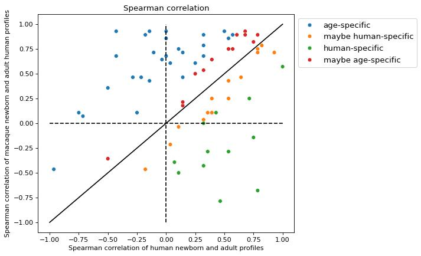

# Human Specific Genes Analysis

This folder contains Jupyter notebooks, raw data, and output figures for analyzing human-specific gene expression in the medial prefrontal cortex (MPFC).

## Contents

- `differential_expression.ipynb`
  - Perform differential expression (edgeR) between human, chimpanzee, and macaque pseudobulk samples.
  - Define human-specific genes based on FDR‐adjusted p-values.

- `human_specific_genes.ipynb`
  - Subset expression matrix to human-specific genes.
  - Calculate layer‐ and condition‐specific average profiles.
  - Compute correlation metrics between adult and newborn samples for validation.
  - Assign gene groups (human-specific, maybe human-specific, etc.).

- `clustering.ipynb`
  - Hierarchical and spectral clustering of human-specific genes across pseudobulk samples.
  - Reorder clusters and save cluster assignments to CSV.
  - Visualize cluster heatmaps and correlation matrices.

- `functional_analysis.ipynb`
  - Perform GO and pathway enrichment (Enrichr/SpeedRichR) for each gene cluster.
  - Generate scatterplots of top terms across clusters.

- `visualise_clusters_scale.ipynb`
  - Map cluster‐averaged expression signatures back onto Visium spatial sections.
  - Apply filtering (Wiener, median, mean) and produce spatial scatter plots.

- `figures/`
  - Directory of key output images generated by the notebooks.

## Main Analysis Steps

1. **Differential Expression**
   - Identify genes significantly enriched in human vs. other primates.
2. **Validation**
   - Compare spatial expression profiles between adult and newborn human samples.
   - Compute correlation metrics (Pearson, Spearman, Kendall).
3. **Clustering**
   - Group human-specific genes into clusters based on pseudobulk patterns.
   - Visualize cluster heatmap and inter-cluster correlations.
4. **Functional Enrichment**
   - Test clusters for overrepresentation of GO terms and pathways.
5. **Spatial Visualization**
   - Project cluster signatures onto spatial transcriptomics sections.
   - Apply noise‐reduction filters to highlight spatial domains.

## Key Figures

### human_specific_genes_validation.jpg

_Scatterplots of Kendall, Pearson, and Spearman correlations validating human-specific gene profiles._

### human_specific_genes_clusters_correlations.jpg

_Combined heatmap and correlation matrix showing relationships among clustered gene signatures._

### human_specific_genes_profiles_splines.jpg

_Smoothed spline profiles of average layer expression for each cluster across species._

### enrichment_human_validation.jpg

_Enrichment validation plots (top GO terms with adjusted p-values)._

### go_biological_processes_2025.jpg

_Scatterplot of GO Biological Process enrichment results for human-specific gene clusters._

### human_specific_genes_profiles_weiner_horizontal.jpg

_Horizontal layout of Wiener-filtered cluster profiles showing spatial expression domains._

### my_figure.jpg

_Custom analysis figure placeholder (e.g., enrichment dotplot or additional visualization)._

---

Open the notebooks above to reproduce analyses and regenerate figures. Contact the authors for questions or data access.
