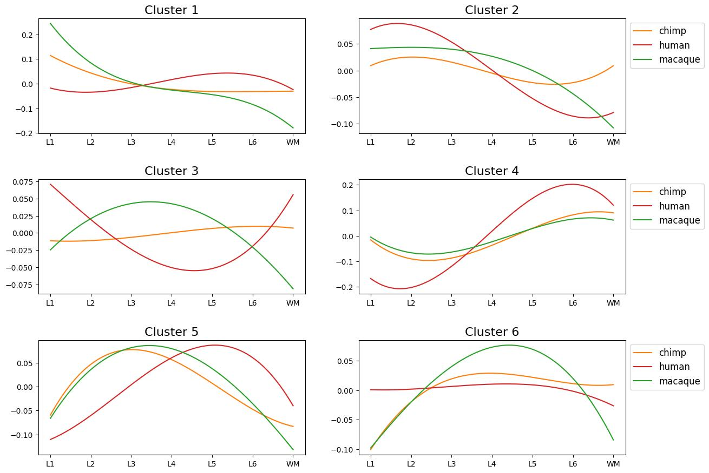

# Human Specific Genes Analysis

This folder contains Jupyter notebooks, raw data, and output figures for analyzing human-specific gene expression in the medial prefrontal cortex (MPFC).

## Contents

- `differential_expression.ipynb`:Perform differential expression (edgeR) between human, chimpanzee, and macaque pseudobulk samples

- `human_specific_genes.ipynb`: Define human-specific genes based on differential expression results and validate against newborn human samples

- `clustering.ipynb`: Hierarchical clustering of human-specific genes across pseudobulk samples and visualization of average cluster profiles

- `functional_analysis.ipynb`: Perform functional analysis for human-specific genes

- `visualise_clusters_scale.ipynb`: Visualize cluster profiles on Visium sections

- `figures/`: Directory of key output images generated by the notebooks.

## Figure Previews

### Validation of human-specific genes

Scatterplot of  Spearman correlation validating human-specific gene profiles.

  

### Clusters of human-specific genes

Combined heatmap and correlation matrix showing clustering of profiles of human-specific genes across species.

### Profiles of human-specific genes

Smoothed spline profiles of average layer expression for each cluster across species

  

### Sankey diagram of human-specific gene clusters

Sankey diagram showing the distribution of human-specific gene clusters across gene groups defined in the validation step.

  

### Functional analysis of human-specific genes

Enrichment analysis of gene groups defined in validation step

### GO Biological Processes 2025

Scatterplot of GO Biological Process enrichment results for human-specific gene clusters

  

### Visualization of human-specific gene clusters on Visium sections

Wiener-filtered profiles of human-specific gene clusters visualized on Visium sections

---

Open the notebooks above to reproduce analyses and regenerate figures. Contact the authors for questions or data access.
