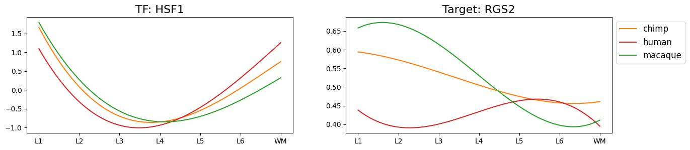

# Transcription Factor Activity Analysis

This folder contains Jupyter notebooks and figures for computing and analyzing transcription factor (TF) activity across cell types and defining human-specific TFs.

## Contents

- `calculate_activity.ipynb`: Infer TF activity scores from  pseudobulk expression data
- `ancova.ipynb`: Perform ANCOVA to test for TF activity differences across conditions
- `human_specific_tfs.ipynb`: Identify TFs with human-specific activity patterns based on statistical tests and visualization.
- `figures/`: Directory containing output plots.

## Key Figures

### Spline Profiles of Human-Specific TF

_Smoothed spline profiles of the only human-specific TF with it's human-specific gene target._

---

Open the notebooks above to reproduce the TF activity analysis and regenerate figures. Contact the authors for questions or data access.
