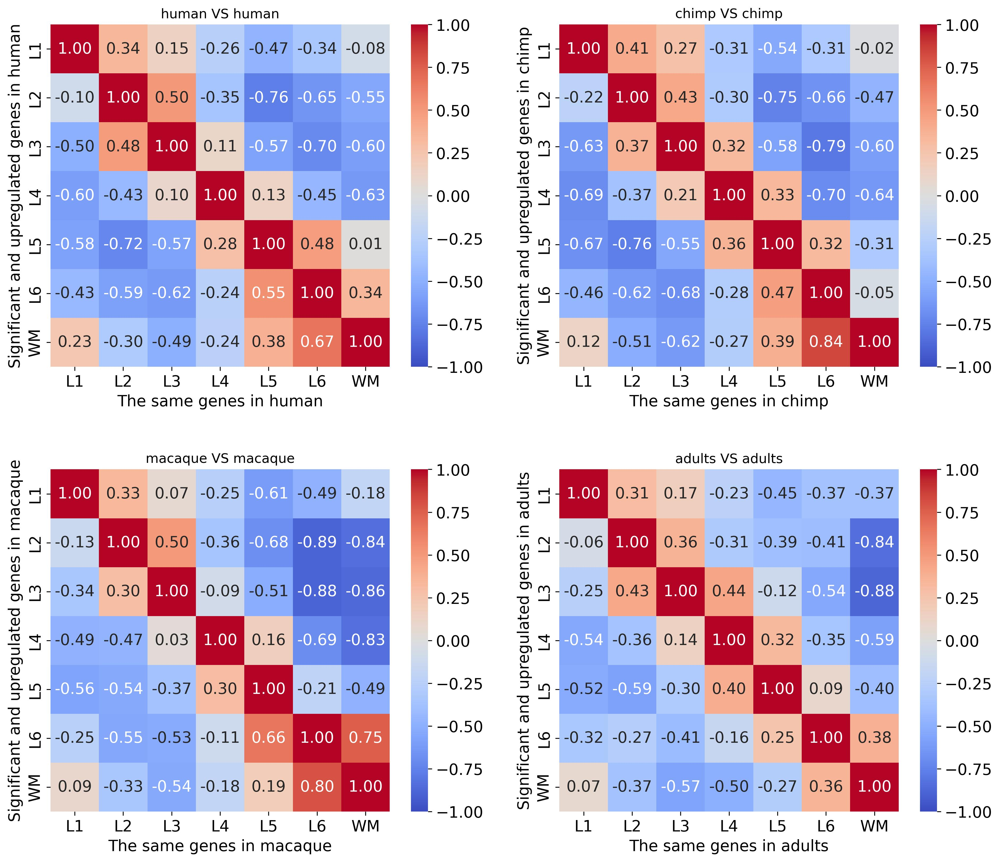
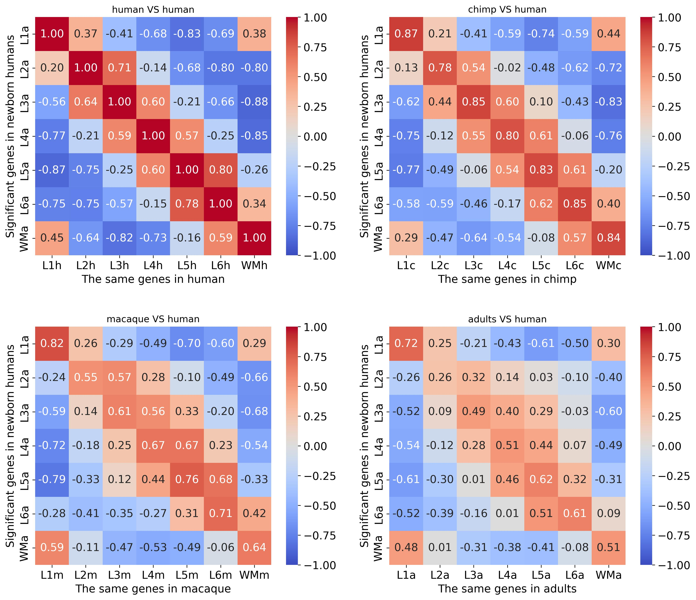

# Layer Annotation Validation

This folder contains scripts and outputs for validating cortical layer marker genes across species.

## Files and Directories

- `validate_layer_annotation.ipynb`  
  Notebook that computes and plots correlation of layer markers within and between species.

- `visualise_selected_markers.ipynb`  
  Notebook that visualizes selected marker genes on Visium spatial slides across species.

- `adults/`, `chimp/`, `human/`, `macaque/`  
  Subfolders with species-specific DE analysis results and figures (see their individual `README.md` files).

- `figures/`  
  Contains correlation heatmap images across species:
  - `inspecie_correlation.jpg`  
    Shows the correlation of marker gene sets for each species against itself (intra-species marker consistency).
  - `adults_correlation.jpg`  
    Shows how adult human (spatialLIBD) marker genes correlate with marker genes from each other species.
  - `newbornhuman_correlation.jpg`  
    Shows how marker genes identified in newborn human samples correlate with markers in each other species.

## Figure Previews

### Intra-species Marker Correlation

  

This heatmap plots the Pearson correlation of significant layer marker gene sets within each species.

### Adult vs. Other Species Correlation

  

Correlation of adult human marker gene sets against those from human newborn, chimpanzee, and macaque.

### Newborn Human vs. Other Species Correlation

  

Correlation of newborn human marker gene sets against those from chimpanzee, macaque, and adult human samples.
