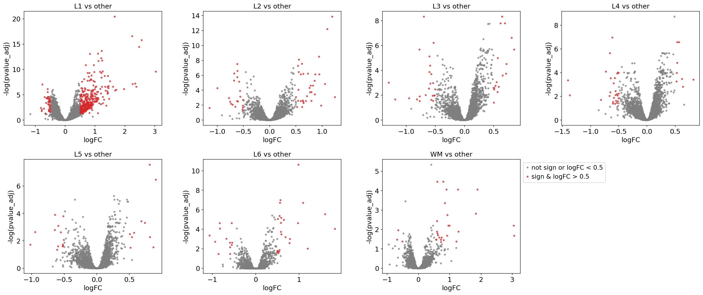
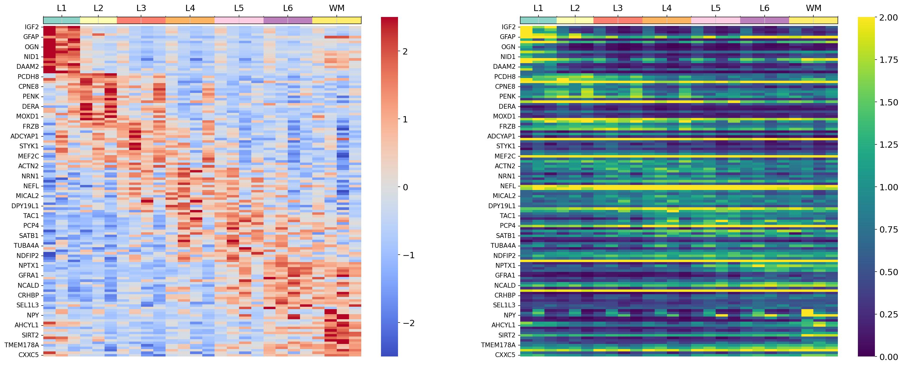
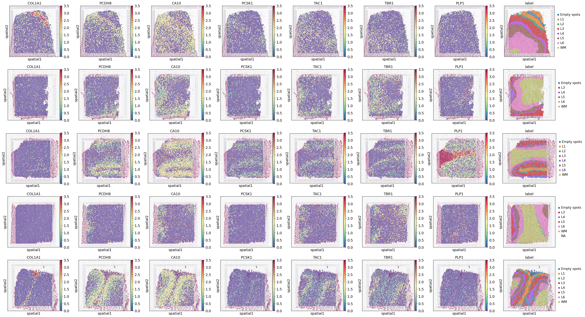
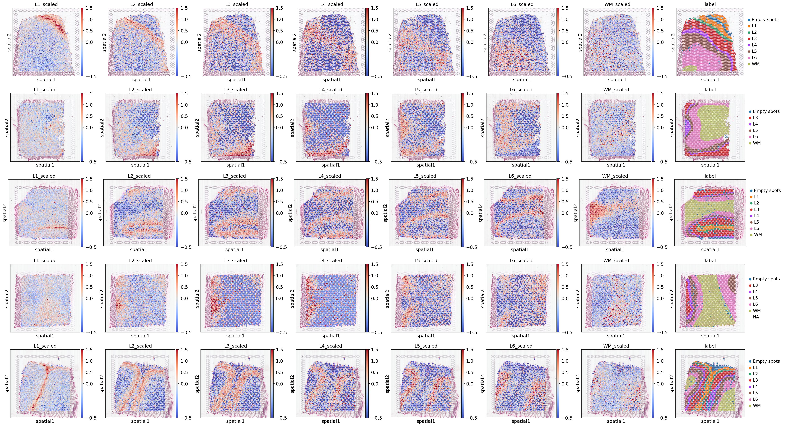

# Chimpanzee DE Analysis Results

This folder contains the differential expression analysis and marker visualization for chimp cortical layers.

**Files:**
- `markers.ipynb`  : Jupyter notebook that runs differential expression analysis to identify layer-specific marker genes.
- `analysis.ipynb`  : Jupyter notebook with analysis of layer markers
- `figures/`  : Directory containing generated figures from the analysis. 

View `analysis.ipynb` for detailed code and step-by-step results.  

## Figure Previews

### Volcano Plot

This volcano plot shows log fold-change versus -log10 adjusted p-value for each cortical layer compared to all others. Significant genes (adj. p<0.05 and |logFC|>0.5) are highlighted in red.

### Marker Heatmap

Heatmap of the top 20 marker genes per layer, with expression values row-scaled. Columns are samples grouped by layer, and colored annotations indicate layer identity.

### Spatial Expression of Markers

Visium spatial scatter plots of individual marker gene expression, showing how each gene is enriched in its corresponding cortical layer in tissue coordinates.

### Aggregated Layer Expression

Aggregated (weighted) average expression of each layer’s marker genes per spot, visualized on the Visium array to highlight layer-specific patterns across the section.
